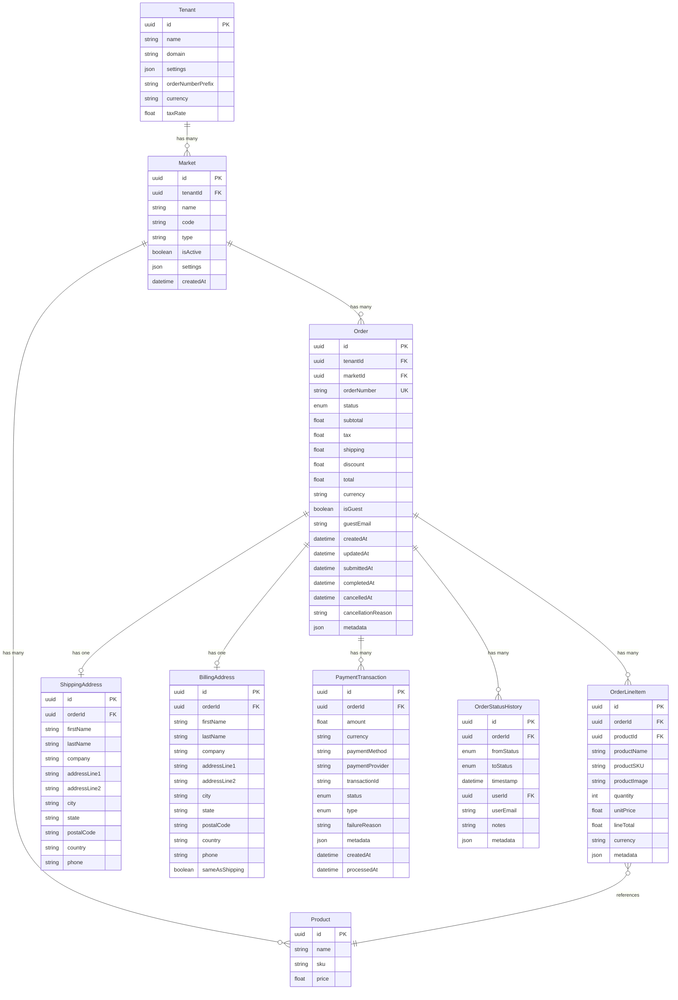

# Data Model: Shopping Cart and Order Management

**Date**: 2025-10-22 | **Branch**: `002-cart-order-management` | **Plan**: [plan.md](./plan.md)

## Overview

This document defines all entities, relationships, validation rules, and persistence strategies for the shopping cart and order management system. The data model supports multi-tenancy, guest and authenticated users, and full order lifecycle tracking from cart (status='new') through completion.

---

## Entity Definitions

### 1. Order

**Purpose**: Represents both shopping carts (status='new') and submitted orders (status!='new'). The core entity that tracks a customer's purchase from initial product selection through payment and fulfillment.

**Properties**:

| Property | Type | Required | Description | Constraints |
|----------|------|----------|-------------|-------------|
| `id` | string (UUID) | Yes | Unique order identifier | Primary key, auto-generated |
| `tenantId` | string (UUID) | Yes | Tenant (store) this order belongs to | Foreign key to Tenant, indexed |
| `marketId` | string (UUID) | Yes | Market this order belongs to | Foreign key to Market, indexed |
| `orderNumber` | string | Yes | Human-readable order number | Unique per tenant, format: `{tenantPrefix}-{sequence}` |
| `status` | OrderStatus | Yes | Current order status | Enum: 'new', 'submitted', 'paid', 'completed', 'cancelled' |
| `subtotal` | number | Yes | Sum of all line item totals (before tax/shipping) | >= 0, precision: 2 decimals |
| `tax` | number | Yes | Tax amount | >= 0, precision: 2 decimals |
| `shipping` | number | Yes | Shipping cost | >= 0, precision: 2 decimals |
| `discount` | number | No | Discount amount (future feature) | >= 0, precision: 2 decimals, default: 0 |
| `total` | number | Yes | Final order total (subtotal + tax + shipping - discount) | >= 0, precision: 2 decimals, calculated field |
| `currency` | string | Yes | Currency code | ISO 4217 (e.g., 'USD'), default: 'USD' |
| `isGuest` | boolean | Yes | Whether this is a guest order | Default: false |
| `guestEmail` | string | No | Email for guest orders | Required if isGuest=true, email format validation |
| `createdAt` | datetime | Yes | When order was created (cart initialized) | ISO 8601 format, auto-generated |
| `updatedAt` | datetime | Yes | When order was last modified | ISO 8601 format, auto-updated |
| `submittedAt` | datetime | No | When order was submitted (status -> 'submitted') | ISO 8601 format, set on transition |
| `completedAt` | datetime | No | When order was completed | ISO 8601 format, set on transition |
| `cancelledAt` | datetime | No | When order was cancelled | ISO 8601 format, set on transition |
| `cancellationReason` | string | No | Reason for cancellation | Max length: 500 characters |
| `metadata` | JSON | No | Additional order metadata | Flexible key-value storage |

**Relationships**:
- `belongsTo` Tenant (via `tenantId`)
- `belongsTo` Market (via `marketId`)
- `hasMany` OrderLineItem (via `lineItems[]`)
- `hasOne` ShippingAddress (via `shippingAddressId`)
- `hasOne` BillingAddress (via `billingAddressId`)
- `hasMany` PaymentTransaction (via `transactions[]`)
- `hasMany` OrderStatusHistory (via `statusHistory[]`)

**Multi-Tenancy & Market Isolation**:
- All queries MUST filter by `tenantId` AND `marketId`
- Order numbers unique per tenant (not globally)
- Cross-tenant and cross-market access strictly forbidden
- All products in order must belong to the same market

**Persistence Strategy**:
- **status='new'**: localStorage only (cart not yet submitted)
- **status!='new'**: API persistence required
- **Transition**: On checkout submit, sync from localStorage to API, then remove from localStorage

**Validation Rules**:
- `marketId` must exist and belong to same `tenantId`
- All products in order line items must belong to `marketId`
- `orderNumber` must be unique within tenant
- `total` must equal `subtotal + tax + shipping - discount`
- `guestEmail` required if `isGuest=true`
- Status transitions must follow valid state machine (see Status Transitions)
- Cannot modify order if `status='completed'` or `status='cancelled'`

---

### 2. OrderLineItem

**Purpose**: Represents a single product entry within an order with quantity, pricing, and product reference.

**Properties**:

| Property | Type | Required | Description | Constraints |
|----------|------|----------|-------------|-------------|
| `id` | string (UUID) | Yes | Unique line item identifier | Primary key, auto-generated |
| `orderId` | string (UUID) | Yes | Parent order | Foreign key to Order, indexed |
| `productId` | string (UUID) | Yes | Product from catalog | Foreign key to Product, indexed |
| `productName` | string | Yes | Product name (snapshot at time of order) | Max length: 200 characters |
| `productSKU` | string | Yes | Product SKU (snapshot) | Max length: 100 characters |
| `productImage` | string (URL) | No | Product image URL (snapshot) | Valid URL format |
| `quantity` | integer | Yes | Quantity ordered | >= 1, <= 999 |
| `unitPrice` | number | Yes | Price per unit (snapshot at time of order) | >= 0, precision: 2 decimals |
| `lineTotal` | number | Yes | Total for this line (quantity × unitPrice) | >= 0, precision: 2 decimals, calculated field |
| `currency` | string | Yes | Currency code | ISO 4217, inherited from Order |
| `metadata` | JSON | No | Additional line item data (e.g., product options) | Flexible key-value storage |

**Relationships**:
- `belongsTo` Order (via `orderId`)
- `references` Product (via `productId`, from Product Catalog feature)

**Validation Rules**:
- `quantity` > 0 and <= 999
- `unitPrice` >= 0
- `lineTotal` must equal `quantity × unitPrice`
- `productId` must exist in Product Catalog
- Cannot modify if parent Order is completed or cancelled
- Product snapshots (name, SKU, price, image) capture data at order time (prevent price changes from affecting historical orders)

**Persistence**:
- **localStorage**: Embedded in Order object as `lineItems[]` array
- **API**: Separate table with foreign key to Order

**Quantity Updates**:
- Changing quantity recalculates `lineTotal` and Order `subtotal`/`total`
- Quantity validation against inventory (if product out of stock)

---

### 3. OrderStatusHistory

**Purpose**: Audit trail of all status changes for an order with timestamps and responsible user.

**Properties**:

| Property | Type | Required | Description | Constraints |
|----------|------|----------|-------------|-------------|
| `id` | string (UUID) | Yes | Unique history entry identifier | Primary key, auto-generated |
| `orderId` | string (UUID) | Yes | Parent order | Foreign key to Order, indexed |
| `fromStatus` | OrderStatus | No | Previous status (null for initial status) | Enum value or null |
| `toStatus` | OrderStatus | Yes | New status | Enum: 'new', 'submitted', 'paid', 'completed', 'cancelled' |
| `timestamp` | datetime | Yes | When status changed | ISO 8601 format, auto-generated |
| `userId` | string (UUID) | No | User who made the change (admin actions) | Foreign key to User, nullable for system actions |
| `userEmail` | string | No | Email of user who made change (for display) | Snapshot for audit trail |
| `notes` | string | No | Reason or notes for status change | Max length: 1000 characters |
| `metadata` | JSON | No | Additional context (e.g., payment gateway response) | Flexible key-value storage |

**Relationships**:
- `belongsTo` Order (via `orderId`)
- `references` User (via `userId`, optional)

**Validation Rules**:
- `fromStatus` → `toStatus` must be valid transition (see Status Transitions)
- `timestamp` must be >= Order.createdAt
- Immutable once created (audit trail integrity)

**Persistence**:
- **API only** (not stored in localStorage)
- Append-only table (never update or delete)

**Status Transitions** (Valid State Machine):

```
new ──────────→ submitted ──────────→ paid ──────────→ completed
 │                  │                    │
 │                  │                    │
 └──────────────────┴────────────────────┴──────────→ cancelled
```

**Valid Transitions**:
- `new` → `submitted` (customer submits order)
- `new` → `cancelled` (customer abandons cart)
- `submitted` → `paid` (payment successful)
- `submitted` → `cancelled` (customer cancels before payment or payment fails)
- `paid` → `completed` (order fulfilled and shipped)
- `paid` → `cancelled` (admin cancels and refunds)

**Invalid Transitions**:
- `completed` → any (final state)
- `cancelled` → any (final state)
- `new` → `paid` (must go through submitted)
- `submitted` → `completed` (must be paid first)
- Any backward transition (e.g., `paid` → `submitted`)

---

### 4. ShippingAddress

**Purpose**: Customer's shipping address for order delivery.

**Properties**:

| Property | Type | Required | Description | Constraints |
|----------|------|----------|-------------|-------------|
| `id` | string (UUID) | Yes | Unique address identifier | Primary key, auto-generated |
| `orderId` | string (UUID) | Yes | Parent order | Foreign key to Order, indexed |
| `firstName` | string | Yes | Recipient first name | Max length: 100 characters |
| `lastName` | string | Yes | Recipient last name | Max length: 100 characters |
| `company` | string | No | Company name | Max length: 100 characters |
| `addressLine1` | string | Yes | Street address line 1 | Max length: 200 characters |
| `addressLine2` | string | No | Street address line 2 (apt, suite, etc.) | Max length: 200 characters |
| `city` | string | Yes | City | Max length: 100 characters |
| `state` | string | Yes | State/province/region | 2-character code (US states) or full name |
| `postalCode` | string | Yes | ZIP/postal code | Format varies by country |
| `country` | string | Yes | Country | ISO 3166-1 alpha-2 code (e.g., 'US', 'CA') |
| `phone` | string | Yes | Contact phone number | E.164 format (e.g., +1234567890) |

**Relationships**:
- `belongsTo` Order (via `orderId`)

**Validation Rules**:
- All required fields must be present
- `postalCode` format validated based on `country`:
  - US: 5 digits or 9 digits (12345 or 12345-6789)
  - CA: A1A 1A1 format
  - Others: basic alphanumeric validation
- `state` validated against country (US states must be valid 2-letter codes)
- `phone` must match E.164 format or simple 10-digit US format
- `country` must be supported country code (MVP: US only, expand later)

**Persistence**:
- **API only** (PII data, not stored in localStorage)
- Encrypted at rest in database

**Address Verification**:
- Optional integration with address verification service (USPS, SmartyStreets)
- Mock: Simple validation of required fields and format
- Real: API call to verification service returns standardized address

---

### 5. BillingAddress

**Purpose**: Customer's billing address for payment processing.

**Properties**: Same as ShippingAddress, plus:

| Property | Type | Required | Description | Constraints |
|----------|------|----------|-------------|-------------|
| `sameAsShipping` | boolean | No | Whether billing address matches shipping | Default: false |

**Relationships**:
- `belongsTo` Order (via `orderId`)

**Validation Rules**:
- Same validation rules as ShippingAddress
- If `sameAsShipping=true`, copy all fields from ShippingAddress (frontend handles this)

**Persistence**:
- **API only** (PII data, not stored in localStorage)
- Encrypted at rest in database

---

### 6. PaymentTransaction

**Purpose**: Record of payment processing for an order (charges and refunds).

**Properties**:

| Property | Type | Required | Description | Constraints |
|----------|------|----------|-------------|-------------|
| `id` | string (UUID) | Yes | Unique transaction identifier | Primary key, auto-generated |
| `orderId` | string (UUID) | Yes | Parent order | Foreign key to Order, indexed |
| `amount` | number | Yes | Transaction amount | > 0, precision: 2 decimals |
| `currency` | string | Yes | Currency code | ISO 4217, inherited from Order |
| `paymentMethod` | string | Yes | Payment method type | Enum: 'credit_card', 'debit_card', 'paypal', 'stripe', 'mock' |
| `paymentProvider` | string | No | Payment gateway provider | E.g., 'stripe', 'paypal', 'mock' |
| `transactionId` | string | No | External transaction ID from payment gateway | Unique, for reconciliation |
| `status` | TransactionStatus | Yes | Transaction status | Enum: 'pending', 'success', 'failed', 'refunded' |
| `type` | TransactionType | Yes | Transaction type | Enum: 'charge', 'refund' |
| `failureReason` | string | No | Reason for failure (if status='failed') | Max length: 500 characters |
| `metadata` | JSON | No | Payment gateway response data | Store full gateway response for debugging |
| `createdAt` | datetime | Yes | When transaction was created | ISO 8601 format, auto-generated |
| `processedAt` | datetime | No | When transaction was processed | ISO 8601 format, set on success/failure |

**Relationships**:
- `belongsTo` Order (via `orderId`)

**Validation Rules**:
- `amount` > 0 for charges, > 0 for refunds
- `type='refund'` → must have prior successful `type='charge'` for same order
- Refund amount cannot exceed sum of successful charges
- `transactionId` should be unique (gateway provides this)
- `status='success'` + `type='charge'` → transition Order to `status='paid'`
- `status='failed'` → do not transition Order status

**Persistence**:
- **API only** (PCI compliance, sensitive payment data)
- Never stored in localStorage
- Payment details (card numbers, etc.) never stored in our database (tokenized by payment gateway)

**Transaction Types**:
- **charge**: Customer pays for order (most common)
- **refund**: Admin refunds customer (partial or full)

**Transaction Statuses**:
- **pending**: Transaction initiated, awaiting gateway response
- **success**: Transaction completed successfully
- **failed**: Transaction failed (insufficient funds, card declined, etc.)
- **refunded**: Charge was refunded (creates separate refund transaction)

---

### 7. Market

**Purpose**: Represents a specific store location or sales channel within a tenant. Orders and products are scoped to markets.

**Properties** (subset relevant to orders):

| Property | Type | Required | Description | Constraints |
|----------|------|----------|-------------|-------------|
| `id` | string (UUID) | Yes | Unique market identifier | Primary key |
| `tenantId` | string (UUID) | Yes | Tenant this market belongs to | Foreign key to Tenant, indexed |
| `name` | string | Yes | Market name | Max length: 200 characters |
| `code` | string | Yes | Market code | Unique per tenant, max length: 20 |
| `type` | string | Yes | Market type | Enum: 'physical', 'online', 'hybrid' |
| `isActive` | boolean | Yes | Whether market is operational | Default: true |
| `settings` | JSON | No | Market-specific settings | Flexible key-value storage |
| `createdAt` | datetime | Yes | When market was created | ISO 8601 format |

**Relationships**:
- `belongsTo` Tenant (via `tenantId`)
- `hasMany` Order (via `orders[]`)
- `hasMany` Product (via `products[]`)

**Multi-Tenancy**:
- Markets isolated by tenant
- Same market name can exist across tenants

**Persistence**:
- **API only**
- Not managed by cart/order feature (referenced only)

---

### 8. Tenant

**Purpose**: Represents a store/merchant in the multi-tenant SaaS platform. Full definition in platform core; this is a reference for tenant context.

**Properties** (subset relevant to orders):

| Property | Type | Required | Description | Constraints |
|----------|------|----------|-------------|-------------|
| `id` | string (UUID) | Yes | Unique tenant identifier | Primary key |
| `name` | string | Yes | Tenant name | Max length: 200 characters |
| `domain` | string | No | Custom domain for tenant | Unique, DNS-valid domain |
| `settings` | JSON | No | Tenant settings (branding, features) | Flexible key-value storage |
| `orderNumberPrefix` | string | Yes | Prefix for order numbers | E.g., 'DEMO', 'ACME', max length: 10 |
| `currency` | string | Yes | Default currency for tenant | ISO 4217, default: 'USD' |
| `taxRate` | number | No | Default tax rate (if not using tax service) | 0-1 (e.g., 0.08 for 8%) |

**Relationships**:
- `hasMany` Market (via `markets[]`)
- `hasMany` Order (via `orders[]`)

**Persistence**:
- **API only**
- Not managed by cart/order feature (referenced only)

**Tenant Context Injection**:
- All API calls include `X-Tenant-ID` header
- API validates tenant exists and user has access
- MSW handlers validate tenantId in requests

---

## Entity Relationship Diagram



---

## TypeScript Type Definitions

```typescript
// src/types/order.ts

/**
 * Order status enum
 * Represents the lifecycle stage of an order from cart to completion
 */
export enum OrderStatus {
  NEW = 'new',           // Shopping cart (not submitted)
  SUBMITTED = 'submitted', // Order submitted, awaiting payment
  PAID = 'paid',         // Payment successful, ready for fulfillment
  COMPLETED = 'completed', // Order fulfilled and delivered
  CANCELLED = 'cancelled', // Order cancelled by customer or admin
}

/**
 * Transaction type enum
 */
export enum TransactionType {
  CHARGE = 'charge',
  REFUND = 'refund',
}

/**
 * Transaction status enum
 */
export enum TransactionStatus {
  PENDING = 'pending',
  SUCCESS = 'success',
  FAILED = 'failed',
  REFUNDED = 'refunded',
}

/**
 * Payment method enum
 */
export enum PaymentMethod {
  CREDIT_CARD = 'credit_card',
  DEBIT_CARD = 'debit_card',
  PAYPAL = 'paypal',
  STRIPE = 'stripe',
  MOCK = 'mock', // For development/testing
}

/**
 * Order entity
 */
export interface Order {
  id: string;
  tenantId: string;
  marketId: string;
  orderNumber: string;
  status: OrderStatus;
  subtotal: number;
  tax: number;
  shipping: number;
  discount: number;
  total: number;
  currency: string;
  isGuest: boolean;
  guestEmail?: string;
  createdAt: string; // ISO 8601
  updatedAt: string; // ISO 8601
  submittedAt?: string; // ISO 8601
  completedAt?: string; // ISO 8601
  cancelledAt?: string; // ISO 8601
  cancellationReason?: string;
  metadata?: Record<string, any>;

  // Relationships (populated in API responses)
  lineItems?: OrderLineItem[];
  shippingAddress?: ShippingAddress;
  billingAddress?: BillingAddress;
  transactions?: PaymentTransaction[];
  statusHistory?: OrderStatusHistory[];
}

/**
 * Order line item entity
 */
export interface OrderLineItem {
  id: string;
  orderId: string;
  productId: string;
  productName: string;
  productSKU: string;
  productImage?: string;
  quantity: number;
  unitPrice: number;
  lineTotal: number;
  currency: string;
  metadata?: Record<string, any>;
}

/**
 * Order status history entry
 */
export interface OrderStatusHistory {
  id: string;
  orderId: string;
  fromStatus?: OrderStatus;
  toStatus: OrderStatus;
  timestamp: string; // ISO 8601
  userId?: string;
  userEmail?: string;
  notes?: string;
  metadata?: Record<string, any>;
}

/**
 * Shipping address entity
 */
export interface ShippingAddress {
  id: string;
  orderId: string;
  firstName: string;
  lastName: string;
  company?: string;
  addressLine1: string;
  addressLine2?: string;
  city: string;
  state: string;
  postalCode: string;
  country: string;
  phone: string;
}

/**
 * Billing address entity
 */
export interface BillingAddress extends Omit<ShippingAddress, 'id'> {
  id: string;
  sameAsShipping?: boolean;
}

/**
 * Payment transaction entity
 */
export interface PaymentTransaction {
  id: string;
  orderId: string;
  amount: number;
  currency: string;
  paymentMethod: PaymentMethod;
  paymentProvider?: string;
  transactionId?: string;
  status: TransactionStatus;
  type: TransactionType;
  failureReason?: string;
  metadata?: Record<string, any>;
  createdAt: string; // ISO 8601
  processedAt?: string; // ISO 8601
}

/**
 * Market entity (subset for orders context)
 */
export interface Market {
  id: string;
  tenantId: string;
  name: string;
  code: string;
  type: 'physical' | 'online' | 'hybrid';
  isActive: boolean;
  settings?: Record<string, any>;
  createdAt: string; // ISO 8601
}

/**
 * Tenant entity (subset for orders context)
 */
export interface Tenant {
  id: string;
  name: string;
  domain?: string;
  settings?: Record<string, any>;
  orderNumberPrefix: string;
  currency: string;
  taxRate?: number;
}

// ========================================
// API Request/Response Types
// ========================================

/**
 * Add to cart request
 */
export interface AddToCartRequest {
  productId: string;
  quantity: number;
}

/**
 * Update cart item request
 */
export interface UpdateCartItemRequest {
  quantity: number;
}

/**
 * Cancel order request
 */
export interface CancelOrderRequest {
  reason: string;
}

/**
 * Checkout validation result
 */
export interface CheckoutValidationResult {
  valid: boolean;
  issues: CheckoutValidationIssue[];
}

export interface CheckoutValidationIssue {
  type: 'out_of_stock' | 'price_change' | 'product_unavailable';
  message: string;
  lineItemId?: string;
  oldValue?: any;
  newValue?: any;
}

/**
 * Shipping option
 */
export interface ShippingOption {
  id: string;
  name: string;
  cost: number;
  estimatedDelivery: string;
  carrier?: string;
}

/**
 * Submit checkout request
 */
export interface SubmitCheckoutRequest {
  shippingAddressId: string;
  billingAddressId: string;
  shippingOptionId: string;
}

/**
 * Payment request
 */
export interface PaymentRequest {
  orderId: string;
  paymentMethodId: string;
  paymentDetails: {
    // Mock payment details (real implementation uses tokenized data)
    cardNumber?: string; // Mock only, never store real card numbers
    cardExpiry?: string;
    cardCVV?: string;
    cardholderName?: string;
  };
}

/**
 * Order list response (paginated)
 */
export interface OrderListResponse {
  orders: Order[];
  totalCount: number;
  page: number;
  limit: number;
}

/**
 * Admin update order status request
 */
export interface UpdateOrderStatusRequest {
  status: OrderStatus;
  notes?: string;
}

/**
 * Admin add order note request
 */
export interface AddOrderNoteRequest {
  note: string;
}

/**
 * Admin refund request
 */
export interface RefundRequest {
  amount: number;
  reason: string;
  refundShipping: boolean;
}

/**
 * API error response
 */
export interface ApiErrorResponse {
  error: string;
  message: string;
  statusCode: number;
  details?: Record<string, any>;
}
```

---

## Validation Rules

### Field-Level Validation

**Order**:
- `id`: UUID v4 format
- `tenantId`: Must exist in Tenant table
- `marketId`: Must exist in Market table and belong to same tenant
- All products in line items must belong to same `marketId`
- `orderNumber`: Unique per tenant, format: `{tenant.orderNumberPrefix}-{sequence}`
- `status`: Must be valid OrderStatus enum value
- `subtotal`, `tax`, `shipping`, `discount`, `total`: >= 0, max 2 decimal places
- `total`: Calculated as `subtotal + tax + shipping - discount`
- `currency`: Valid ISO 4217 code (MVP: 'USD' only)
- `guestEmail`: Required if `isGuest=true`, valid email format
- Timestamps: Valid ISO 8601 datetime strings

**OrderLineItem**:
- `quantity`: Integer >= 1 and <= 999
- `unitPrice`: >= 0, max 2 decimal places
- `lineTotal`: Calculated as `quantity × unitPrice`
- `productId`: Must exist in Product Catalog
- `productName`, `productSKU`: Non-empty strings (snapshots required)

**ShippingAddress / BillingAddress**:
- `firstName`, `lastName`, `addressLine1`, `city`, `state`, `country`: Required, non-empty
- `postalCode`: Format validated based on country (US: /^\d{5}(-\d{4})?$/)
- `phone`: E.164 format or 10-digit US format
- `country`: ISO 3166-1 alpha-2 code (MVP: 'US' only)

**PaymentTransaction**:
- `amount`: > 0, max 2 decimal places
- `type='refund'`: Refund amount <= sum of successful charges for order
- `transactionId`: Unique, provided by payment gateway

### Business Rule Validation

**Status Transitions**:
- Only valid transitions allowed (see state machine diagram)
- Cannot transition from terminal states (`completed`, `cancelled`)
- `new` → `submitted`: Requires valid shipping and billing addresses
- `submitted` → `paid`: Requires successful payment transaction
- Any → `cancelled`: Allowed from non-terminal states

**Cart Operations**:
- Cannot modify order if status != 'new'
- Cannot add duplicate products (increment quantity instead)
- Product must be in stock (check with Product Catalog)
- Total cart value must be > 0 to proceed to checkout

**Checkout Validation**:
- Cart must have at least 1 line item
- All products must still be in stock
- Product prices must not have changed (or show warning)
- Shipping address must be valid and deliverable
- Billing address must be valid

**Order Cancellation**:
- Customer can cancel if status = 'new' or 'submitted'
- Customer cannot cancel if status = 'paid' or later (must contact support)
- Admin can cancel at any status (with refund if paid)

### Cross-Field Validation

**Order Totals**:
```typescript
function validateOrderTotals(order: Order): boolean {
  const calculatedSubtotal = order.lineItems.reduce((sum, item) => sum + item.lineTotal, 0);
  const calculatedTotal = calculatedSubtotal + order.tax + order.shipping - order.discount;

  return (
    Math.abs(order.subtotal - calculatedSubtotal) < 0.01 &&
    Math.abs(order.total - calculatedTotal) < 0.01
  );
}
```

**Billing Same as Shipping**:
```typescript
function validateBillingAddress(billing: BillingAddress, shipping: ShippingAddress): boolean {
  if (!billing.sameAsShipping) return true; // No validation needed

  return (
    billing.firstName === shipping.firstName &&
    billing.lastName === shipping.lastName &&
    billing.addressLine1 === shipping.addressLine1 &&
    billing.city === shipping.city &&
    billing.state === shipping.state &&
    billing.postalCode === shipping.postalCode &&
    billing.country === shipping.country &&
    billing.phone === shipping.phone
  );
}
```

### Multi-Tenancy & Market Validation

**Tenant & Market Isolation**:
```typescript
function validateTenantAndMarketAccess(
  order: Order,
  currentTenantId: string,
  currentMarketId: string
): boolean {
  return order.tenantId === currentTenantId && order.marketId === currentMarketId;
}

function validateMarketBelongsToTenant(market: Market, tenantId: string): boolean {
  return market.tenantId === tenantId;
}

function validateAllProductsBelongToMarket(order: Order): boolean {
  return order.lineItems.every(item => item.productId.startsWith(order.marketId));
}
```

**API Request Validation**:
- All API requests MUST include `X-Tenant-ID` and `X-Market-ID` headers
- Server validates tenant and market exist and user has access
- Query results MUST be filtered by `tenantId` AND `marketId`
- Cross-tenant or cross-market access returns 403 Forbidden
- Superadmin can access all tenants and markets

---

## Persistence Strategy

### localStorage (Frontend Only)

**What is Stored**:
- Active cart (Order with status='new')
- Line items array embedded in Order object
- Checkout flow state (shipping/billing forms in progress)

**Storage Key**:
- `cart-storage`: Zustand persist key for cart state

**Data Structure**:
```json
{
  "state": {
    "cart": {
      "id": "temp-cart-123",
      "status": "new",
      "lineItems": [
        {
          "id": "temp-item-1",
          "productId": "prod-123",
          "productName": "Product Name",
          "quantity": 2,
          "unitPrice": 29.99,
          "lineTotal": 59.98
        }
      ],
      "subtotal": 59.98,
      "tax": 0,
      "shipping": 0,
      "total": 59.98
    }
  },
  "version": 1
}
```

**Lifecycle**:
1. Cart created on first "Add to Cart" action
2. Persists across browser sessions (until cleared or submitted)
3. On checkout submit: Sync to API, receive server-generated Order ID
4. Remove from localStorage after successful API sync
5. If checkout fails: Keep in localStorage for retry

**Cleanup**:
- 30-day expiry check on app load (check `cart.updatedAt`)
- Clear on logout (optional, based on UX requirements)
- Manual "Clear cart" button

### API Persistence

**What is Stored**:
- All orders with status != 'new'
- Shipping and billing addresses (PII data)
- Payment transactions
- Order status history

**Database Schema** (PostgreSQL):
- Multi-tenant, market-scoped schema: All tables have `tenant_id` and `market_id` columns
- Row-level security: Queries automatically filtered by tenant and market
- Indexes: `(tenant_id, market_id)`, `order_number`, `status`, `created_at`
- Composite index: `(tenant_id, market_id, status, created_at)` for filtering

**Sync Strategy**:
```typescript
async function syncCartToAPI(localCart: Order): Promise<Order> {
  // 1. Send cart data to API
  const apiOrder = await api.post<Order>('/api/v1/orders', {
    lineItems: localCart.lineItems,
    // ... other fields
  });

  // 2. Receive server-generated Order with ID and orderNumber
  // 3. Remove from localStorage
  useCartStore.getState().clearCart();

  // 4. Return server Order
  return apiOrder;
}
```

### Data Consistency

**Optimistic Updates**:
- Cart quantity changes applied immediately to localStorage
- API call in background
- Rollback if API call fails

**Conflict Resolution**:
- localStorage is source of truth for status='new' orders
- API is source of truth for status!='new' orders
- If user has cart in localStorage AND API (rare edge case):
  - Prompt user: "You have items in your cart. Load saved cart or keep current?"
  - User choice: Merge, replace, or keep current

**Price Changes**:
- Line items store snapshot of `unitPrice` at time of add-to-cart
- Checkout validation checks current product price
- If price changed: Show warning, update `unitPrice`, recalculate totals
- User must acknowledge price change to proceed

---

## Calculated Fields

**Order.total**:
```typescript
function calculateOrderTotal(order: Order): number {
  return order.subtotal + order.tax + order.shipping - order.discount;
}
```

**Order.subtotal**:
```typescript
function calculateOrderSubtotal(order: Order): number {
  return order.lineItems.reduce((sum, item) => sum + item.lineTotal, 0);
}
```

**OrderLineItem.lineTotal**:
```typescript
function calculateLineTotal(item: OrderLineItem): number {
  return item.quantity * item.unitPrice;
}
```

**Tax Calculation** (MVP: Simple fixed rate):
```typescript
function calculateTax(subtotal: number, taxRate: number): number {
  return Math.round(subtotal * taxRate * 100) / 100; // Round to 2 decimals
}
```

**Shipping Calculation** (MVP: Simple flat rate or tiered):
```typescript
function calculateShipping(subtotal: number, shippingOption: ShippingOption): number {
  // Free shipping over $100
  if (subtotal >= 100) return 0;

  return shippingOption.cost;
}
```

---

## Version History

| Version | Date | Changes |
|---------|------|---------|
| 1.0 | 2025-10-22 | Initial data model definition |

---

**Document Status**: Complete - Ready for Phase 1 Contract Development
**Next Steps**: Create OpenAPI contract files using these entity definitions
